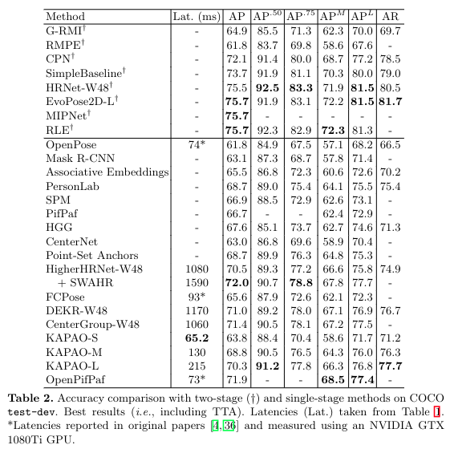

# awesome-human-pose-estimation 

## Table of Contents
- [Single-Person 2D Pose Estimation](#single-person-2d-pose-estimation)
- [3D Mesh Recovery from video](#3d-mesh-recovery-from-video)
- [3D People Tracking](#3d-people-tracking)
- [Multi-Person 3D Mesh Recovery](#multi-person-3d-mesh-recovery)
- [Single-Person 3D Mesh Recovery](#single-person-3d-mesh-recovery)
- [Multi-Person 2D Pose Estimation](#multi-person-2d-pose-estimation)
- [Multi-Person 3D Pose Estimation](#multi-person-3d-pose-estimation)
- [Backbone](#backbone)

## 3D Whole-Body Mesh Recovery
### 2022

##### • PyMAF-X: Towards Well-aligned Full-body Model Regression from Monocular Images - [[code]](https://github.com/HongwenZhang/PyMAF) [[paper]](https://arxiv.org/pdf/2207.06400.pdf) - Arxiv, PyMAF-X
*Hongwen Zhang, Yating Tian, Yuxiang Zhang, Mengcheng Li, Liang An, Zhenan Sun, Yebin Liu*

##### • Accurate 3D Hand Pose Estimation for Whole-Body 3D Human Mesh Estimation - [[code]](https://github.com/mks0601/Hand4Whole_RELEASE) [[paper]](https://arxiv.org/pdf/2011.11534.pdf) - CVPRW, Hand4Whole
*Gyeongsik Moon, Hongsuk Choi, Kyoung Mu Lee*

### 2021
##### • Collaborative Regression of Expressive Bodies using Moderation - [[code]](https://github.com/YadiraF/PIXIE) [[paper]](https://arxiv.org/pdf/2105.05301.pdf) - 3DV, PIXIE
*Yao Feng, Vasileios Choutas, Timo Bolkart, Dimitrios Tzionas, Michael J. Black*

##### • FrankMocap: Fast Monocular 3D Hand and Body Motion Capture by Regression and Integration - [[code]](https://github.com/facebookresearch/frankmocap) [[paper]](https://arxiv.org/pdf/2008.08324.pdf) - ICCV workshop, FrankMocap
*Ye Yuan, Umar Iqbal, Pavlo Molchanov, Kris Kitani, Jan Kautz*

##### • Monocular Real-time Full Body Capture with Inter-part Correlations - [[paper]](https://arxiv.org/pdf/2012.06087.pdf) - CVPR 21, Zhou et al
*Yuxiao Zhou, Marc Habermann, Ikhsanul Habibie, Ayush Tewari, Christian Theobalt, Feng Xu*

### 2020
##### • Whole-Body Human Pose Estimation in the Wild - [[code]](https://github.com/jin-s13/COCO-WholeBody) [[paper]](https://arxiv.org/pdf/2007.11858.pdf) - ECCV, COCO-WholeBody, (only Keypoint)
*Jin, Sheng and Xu, Lumin and Xu, Jin and Wang, Can and Liu, Wentao and Qian, Chen and Ouyang, Wanli and Luo, Ping*

##### • Monocular Expressive Body Regression through Body-Driven Attention - [[code]](https://github.com/vchoutas/expose) [[paper]](https://arxiv.org/pdf/2008.09062.pdf) - ECCV, Expose
*Vasileios Choutas, Georgios Pavlakos, Timo Bolkart, Dimitrios Tzionas, Michael J. Black*

### 2019
##### • Expressive Body Capture: 3D Hands, Face, and Body from a Single Image -[[code]](https://github.com/vchoutas/smplx) [[paper]](https://arxiv.org/abs/1904.05866) - CVPR 19, SMPL-X
*Pavlakos, Georgios and Choutas, Vasileios and Ghorbani, Nima and Bolkart, Timo and Osman, Ahmed A. A. and Tzionas, Dimitrios and Black, Michael J.*

***
## Single-Person 2D Pose Estimation
### 2022
##### • SimCC: a Simple Coordinate Classification Perspective for Human Pose Estimation - [[code]](https://github.com/leeyegy/SimCC) [[paper]](https://arxiv.org/pdf/2107.03332.pdf) - ECCV 22, SimCC

***
## 3D Mesh Recovery from video
### 2022
##### • GLAMR: Global Occlusion-Aware Human Mesh Recovery with Dynamic Cameras - [[code]](https://github.com/NVlabs/GLAMR) [[paper]](https://arxiv.org/pdf/2112.01524.pdf) - CVPR 22, GLAMR
*Ye Yuan, Umar Iqbal, Pavlo Molchanov, Kris Kitani, Jan Kautz*

##### • Capturing Humans in Motion: Temporal-Attentive 3D Human Pose and Shape Estimation from Monocular Video - [[paper]](https://arxiv.org/pdf/2203.08534.pdf) - CVPR 22, MPS-Net
*Wen-Li Wei, Jen-Chun Lin, Tyng-Luh Liu, Hong-Yuan Mark Liao*

### 2021
##### • Beyond Static Features for Temporally Consistent 3D Human Pose and Shape from a Video - [[code]](https://github.com/hongsukchoi/TCMR_RELEASE) [[paper]](https://arxiv.org/pdf/2011.08627.pdf) - CVPR 21, TCMR
*Hongsuk Choi, Gyeongsik Moon, Ju Yong Chang, Kyoung Mu Lee*

### 2020
##### • VIBE: Video Inference for Human Body Pose and Shape Estimation - [[code]](https://github.com/mkocabas/VIBE) [[paper]](https://arxiv.org/pdf/1912.05656.pdf) - CVPR 20, VIBE
*Muhammed Kocabas, Nikos Athanasiou, Michael J. Black*
***
## 3D People Tracking
### 2022
##### • Tracking People by Predicting 3D Appearance, Location & Pose - [[code]](https://github.com/brjathu/PHALP) [[paper]](https://arxiv.org/pdf/2112.04477.pdf) - CVPR 22, PHALP
*Jathushan Rajasegaran, Georgios Pavlakos, Angjoo Kanazawa, Jitendra Malik*

### 2021
##### • TesseTrack: End-to-End Learnable Multi-Person Articulated 3D Pose Tracking - [[paper]](https://openaccess.thecvf.com/content/CVPR2021/papers/Reddy_TesseTrack_End-to-End_Learnable_Multi-Person_Articulated_3D_Pose_Tracking_CVPR_2021_paper.pdf) - CVPR 21, TesseTrack
*N Dinesh Reddy, Laurent Guigues, Leonid Pishchulin, Jayan Eledath, Srinivasa G. Narasimhan*

##### • Tracking People with 3D Representations - [[code]](https://github.com/brjathu/T3DP) [[paper]](https://arxiv.org/pdf/2111.07868.pdf) - NeurIPS 21, HMAR
*Jathushan Rajasegaran, Georgios Pavlakos, Angjoo Kanazawa, Jitendra Malik*
***

## Multi-Person 3D Mesh Recovery
### 2022
##### • Putting People in their Place: Monocular Regression of 3D People in Depth - [[code]](https://github.com/Arthur151/ROMP) [[paper]](https://arxiv.org/pdf/2112.08274.pdf) [[preview]](papers/Putting_People_in_their_Place_Monocular_Regression_of_3D_People_in_Depth.pdf) - CVPR 22, BEV
*Yu Sun, Wu Liu, Qian Bao, Yili Fu, Tao Mei, Michael J. Black*

##### • Learning to Estimate Robust 3D Human Mesh from In-the-Wild Crowded Scenes - [[code]](https://github.com/hongsukchoi/3DCrowdNet_RELEASE) [[paper]](https://arxiv.org/pdf/2104.07300.pdf) - CVPR 22, 3DCrowdNet
*Hongsuk Choi, Gyeongsik Moon, JoonKyu Park, Kyoung Mu Lee*

### 2021
##### • Monocular, One-stage, Regression of Multiple 3D People - [[code]](https://github.com/Arthur151/ROMP) [[paper]](https://arxiv.org/pdf/2008.12272.pdf) - ICCV 21, ROMP
*Yu Sun, Qian Bao, Wu Liu, Yili Fu, Michael J. Black, Tao Mei*

***
## Single-Person 3D Mesh Recovery
### 2021
##### • HybrIK: A Hybrid Analytical-Neural Inverse Kinematics Solution for 3D Human Pose and Shape Estimation - [[code]](https://github.com/Jeff-sjtu/HybrIK) [[paper]](https://arxiv.org/pdf/2011.14672.pdf) - CVPR 21, HybrIK
*Jiefeng Li, Chao Xu, Zhicun Chen, Siyuan Bian, Lixin Yang, Cewu Lu*

##### • Mesh Graphormer- [[code]](https://github.com/microsoft/MeshGraphormer) [[paper]](https://arxiv.org/pdf/2104.00272.pdf) - ICCV 21, Mesh Graphormer
*Kevin Lin, Lijuan Wang, Zicheng Liu*

##### • End-to-End Human Pose and Mesh Reconstruction with Transformers - [[code]](https://github.com/microsoft/MeshTransformer) [[paper]](https://arxiv.org/pdf/2012.09760.pdf) - CVPR 21, METRO
*Kevin Lin, Lijuan Wang, Zicheng Liu*

## Multi-Person 2D Pose Estimation

### 2022
##### • Distribution-Aware Single-Stage Models for Multi-Person 3D Pose Estimation - [[paper]](https://arxiv.org/pdf/2203.07697.pdf) - CVPR 22, DAS
*Zitian Wang, Xuecheng Nie, Xiaochao Qu, Yunpeng Chen, Si Liu*

##### • Learning Local-Global Contextual Adaptation for Multi-Person Pose Estimation - [[code]](https://github.com/cherubicXN/logocap) [[paper]](https://arxiv.org/pdf/2109.03622.pdf) - CVPR 22, LOGO-CAP
*Nan Xue, Tianfu Wu, Gui-Song Xia, Liangpei Zhang*

##### • End-to-End Multi-Person Pose Estimation with Transformers - [[code]](https://github.com/hikvision-research/opera) [[paper]](https://openaccess.thecvf.com/content/CVPR2022/papers/Shi_End-to-End_Multi-Person_Pose_Estimation_With_Transformers_CVPR_2022_paper.pdf) - CVPR 22, PETR
*Dahu Shi1, Xing Wei2, Liangqi Li, Ye Ren, Wenming Tan*

##### • Lite Pose: Efficient Architecture Design for 2D Human Pose Estimation - [[code]](https://github.com/mit-han-lab/litepose) [[paper]](https://arxiv.org/pdf/2205.01271.pdf) - CVPR 22, Lite Pose
*Yihan Wang, Muyang Li, Han Cai, Wei-Ming Chen, Song Han*

##### • Contextual Instance Decoupling for Robust Multi-Person Pose Estimation - [[code]](https://github.com/kennethwdk/CID) [[paper]](https://openaccess.thecvf.com/content/CVPR2022/papers/Wang_Contextual_Instance_Decoupling_for_Robust_Multi-Person_Pose_Estimation_CVPR_2022_paper.pdf) - CVPR 22, CID
*Dongkai Wang, Shiliang Zhang*

##### • Location-Free Human Pose Estimation - [[paper]](https://arxiv.org/pdf/2205.12619.pdf) - CVPR 22
*Xixia Xu, Yingguo Gao, Ke Yan, Xue Lin, Qi Zou*

### 2021

##### • Rethinking Keypoint Representations: Modeling Keypoints and Poses as Objects for Multi-Person Human Pose Estimation - [[code]](https://github.com/wmcnally/kapao) [[paper]](https://arxiv.org/pdf/2111.08557.pdf) - Arxiv 21.11, KAPAO
*William McNally, Kanav Vats, Alexander Wong, John McPhee*

##### • Bottom-Up Human Pose Estimation Via Disentangled Keypoint Regression - [[code]](https://github.com/HRNet/DEKR) [[paper]](https://arxiv.org/pdf/2104.02300.pdf) - CVPR 21, DEKR
*Zigang Geng, Ke Sun, Bin Xiao, Zhaoxiang Zhang, Jingdong Wang*

##### • OpenPifPaf: Composite Fields for Semantic Keypoint Detection and Spatio-Temporal Association - [[code]](https://github.com/openpifpaf/openpifpaf) [[paper]](https://arxiv.org/pdf/2103.02440.pdf) - Arxiv 21.03, OpenPifPaf 
*Sven Kreiss, Lorenzo Bertoni, Alexandre Alahi*

##### • Human Pose Regression with Residual Log-likelihood Estimation - [[code]](https://github.com/Jeff-sjtu/res-loglikelihood-regression) [[paper]](https://arxiv.org/pdf/2107.11291.pdf) - ICCV 21, RLE 
*Jiefeng Li, Siyuan Bian, Ailing Zeng, Can Wang, Bo Pang, Wentao Liu, Cewu Lu*

##### • Multi-Instance Pose Networks: Rethinking Top-Down Pose Estimation - [[code]](https://github.com/rawalkhirodkar/MIPNet) [[paper]](https://arxiv.org/pdf/2101.11223.pdf) - ICCV 21, MIPNet
*Rawal Khirodkar, Visesh Chari, Amit Agrawal, Ambrish Tyagi*

##### • Robust Pose Estimation in Crowded Scenes with Direct Pose-Level Inference - [[code]](https://github.com/kennethwdk/pinet) [[paper]](https://papers.nips.cc/paper/2021/file/31857b449c407203749ae32dd0e7d64a-Paper.pdf) - NeurIPS 21, PINet
*Dongkai Wang, Shiliang Zhang, Gang Hua*

### 2020
##### • HigherHRNet: Scale-Aware Representation Learning for Bottom-Up Human Pose Estimation - [[code]](https://github.com/HRNet/HigherHRNet-Human-Pose-Estimation) [[paper]](https://arxiv.org/pdf/1908.10357.pdf) - CVPR 20, HigherHRNet
*Bowen Cheng, Bin Xiao, Jingdong Wang, Honghui Shi, Thomas S. Huang, Lei Zhang*

##### • Distribution-Aware Coordinate Representation for Human Pose Estimation - [[code]](https://github.com/ilovepose/DarkPose) [[paper]](https://arxiv.org/pdf/1910.06278.pdf) - CVPR 20, DARK
*Feng Zhang, Xiatian Zhu, Hanbin Dai, Mao Ye, Ce Zhu*

### 2019
##### • PifPaf: Composite Fields for Human Pose Estimation - [[code]](https://github.com/openpifpaf/openpifpaf) [[paper]](https://arxiv.org/pdf/2104.02300.pdf) - CVPR 19, PifPaf 
*Sven Kreiss, Lorenzo Bertoni, Alexandre Alahi*

***

## Multi-Person 3D Pose Estimation
### 2022
##### • Single-Stage is Enough: Multi-Person Absolute 3D Pose Estimation - [[paper]](https://openaccess.thecvf.com/content/CVPR2022/papers/Jin_Single-Stage_Is_Enough_Multi-Person_Absolute_3D_Pose_Estimation_CVPR_2022_paper.pdf) - CVPR 22, DRM
*Lei Jin, Chenyang Xu, Xiaojuan Wang, Yabo Xiao, Yandong Guo, Xuecheng Nie, Jian Zhao*

***
## Backbone
### 2022
##### • ViTPose: Simple Vision Transformer Baselines for Human Pose Estimation - [[code]](https://github.com/vitae-transformer/vitpose) [[paper]](https://arxiv.org/pdf/2204.12484.pdf) - Arxiv 22, ViTPose
*Yufei Xu, Jing Zhang, Qiming Zhang, Dacheng Tao*

### 2021
##### • HRFormer: High-Resolution Transformer for Dense Prediction - [[code]](https://github.com/HRNet/HRFormer) [[paper]](https://arxiv.org/pdf/2110.09408.pdf) - NeurIPS 21, HRFormer
*Yuhui Yuan, Rao Fu, Lang Huang, Weihong Lin, Chao Zhang, Xilin Chen, Jingdong Wang*

***
## Datasets
##### borrowed from 'Recovering 3D Human Mesh from Monocular Images: A Survey'
### Rendered Datasets
| Dataset    | # Frames | # Scenes | # Subjects | # Subjects Per Frame | In-the-wild | Mesh Type | Mesh Annotation Source |
|------------|----------|----------|------------|----------------------|-------------|-----------|------------------------|
| SURREAL    | 6.5M     | 2,607    | 145        | 1                    | -           | SMPL      |                        |
| GTA-Human  | 1.4M     | -        | >600       | -                    | -           | SMPL      |                        |
| AGORA      | 17K      | -        | >350       | 5~15                 | -           | SMPL-X    |                        |
| THUman2.0  | -        | -        | ~200       | 1                    | -           | SMPL-X    |                        |
| MultiHuman | -        | -        | ~50        | 1~3                  | -           | SMPL-X    |                        |

### Marker/Sensor based MoCap
| Dataset   | # Frames | # Scenes | # Subjects | # Subjects Per Frame | In-the-wild | Mesh Type | Mesh Annotation Source |
|-----------|----------|----------|------------|----------------------|-------------|-----------|------------------------|
| HumanEva  | 80K      | 1        | 4          | 1                    | -           | -         |                        |
| Human3.6M | 3.6M     | 1        | 11         | 1                    | -           | SMPL-X    | NeuralAnnot            |
| 3DPW      | >51K     | 60       | 7          | 1~2                  | yes         | SMPL-X    | NeuralAnnot            |

### Marker-less Multi-view MoCap
| Dataset            | # Frames | # Scenes | # Subjects | # Subjects Per Frame | In-the-wild | Mesh Type | Mesh Annotation Source |
|--------------------|----------|----------|------------|----------------------|-------------|-----------|------------------------|
| CMU Panoptic       | 1.5M     | 1        | 40         | 3~8                  | -           | -         |                        |
| MPI-INF-3DHP       | >1.3M    | 1        | 8          | 1                    | yes         | SMPL-X    | NeuralAnnot            |
| MuCo-3DHP          | 200K     | 1        | 8          | 1~4                  | -           | -         |                        |
| MuPoTs-3D          | >8K      | 20       | 8          | 3                    | yes         | -         |                        |
| MannequinChallenge | 24,428   | 567      | 742        | 5                    | yes         | SMPL      |                        |
| 3DOH50K            | 51,600   | 1        | -          | 1                    | -           | SMPL      |                        |
| Mirrored-Human     | 1.8M     | >200     | >200       | >=1                  | yes         | SMPL      |                        |
| MTC                | 834K     | 1        | 40         | 1                    | -           | -         |                        |
| EHF                | 100      | 1        | 1          | 1                    | -           | SMPL-X    |                        |
| HUMBI              | 17.3M    | 1        | 772        | 1                    | -           | SMPL      |                        |
| ZJU-MoCap          | -        | 1        | 9          | 1                    | -           | SMPL-X    |                        |

### Datasets with pseudo 3D GT
| Dataset      | # Frames | # Scenes | # Subjects | # Subjects Per Frame | In-the-wild | Mesh Type | Mesh Annotation Source |
|--------------|----------|----------|------------|----------------------|-------------|-----------|------------------------|
| LSP          | 2K       | -        | -          | 1                    | yes         | SMPL      |                        |
| LSP-Extended | 10K      | -        | -          | 1                    | yes         | SMPL      |                        |
| PennAction   | 77K      | 2,326    | 2,326      | 1                    | yes         | SMPL      |                        |
| MSCOCO       | 38K      | -        | -          | >=1                  | yes         | SMPL      |                        |
| MPII         | 24,920   | 3,913    | >40K       | >=1                  | yes         | SMPL      |                        |
| UP-3D        | 8,515    | -        | -          | 1                    | yes         | SMPL      |                        |
| PoseTrack    | 66,374   | 550      | 550        | >1                   | yes         | SMPL-X    | NeuralAnnot            |
| SSP-3D       | 311      | 62       | 62         | 1                    | yes         | SMPL      |                        |
| OCHuman      | 4,731    | -        | 8110       | >1                   | yes         | SMPL      |                        |
| MTP          | 3,731    | -        | 148        | 1                    | yes         | SMPL-X    |                        |
***
## Experiments
### COCO test-dev
 - borrowed from KAPAO

